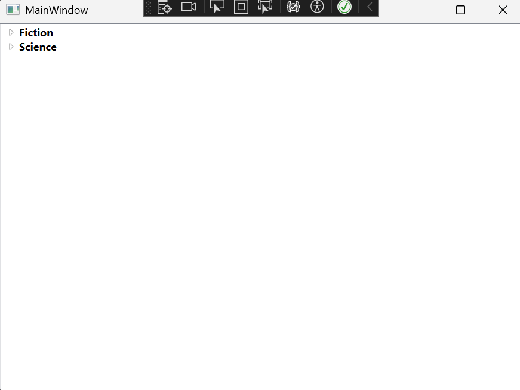

I soo cool way of displaying data in tree loaded from XML file.
I saw demo using similar technic in the book WPF Control Development Unleashed, I'm rewriting it under .Net 8.0
Source code for this book can be downloaded at the following website:
informit.com/title/9780672330339

Result App Screenshot:
